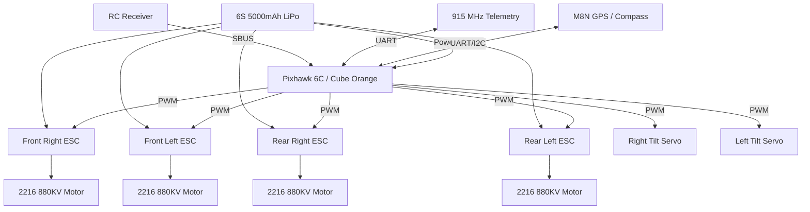
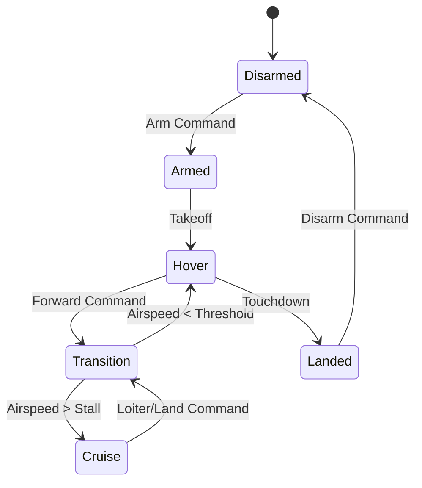

<div align="center">
  <h1>REI-Drone: Open Source VTOL Tilt-Rotor UAV</h1>
  <p><strong>Design, Simulation, and Experimental Analysis of a Modular VTOL Unmanned Aerial Vehicle</strong></p>
  
  

  <p align="center">
    
    
    
    
  </p>
</div>

---

## About the Project

Developed by **Rootcastle Engineering & Innovation**, this repository contains the complete flight stack, MATLAB simulation suite, and research paper for a modern **Modular VTOL (Vertical Take-Off and Landing) Tilt-Rotor UAV**. 

Designed for both academic research and practical implementation, this project bridges the gap between aerodynamic theory and real-world embedded flight control.

**👤 Author:** Batuhan Ayribas, M.Sc.  
**🌐 Website:** [batuhanayribas.com](https://batuhanayribas.com)  

---

## Key Features

- **Complete MATLAB Suite:** Full 6-DOF flight dynamics, aerodynamic force modeling, and PID tuning scripts.
- **Custom C++ Firmware:** Includes advanced state estimation, VTOL motor mixing, and transition logic.
- **Tilt-Rotor Dynamics:** Sophisticated state machine handling smooth transitions between hover and cruise modes.
- **Academic Validation:** Accompanied by a comprehensive research paper detailing mathematical models and experimental data.

---

## System Architecture

### Hardware & Avionics Flow

The avionics are centered around an advanced flight controller (Pixhawk 6C / Cube Orange), directing custom C++ logic through PWM outputs to the vehicle's ESCs and high-torque tilt servos.



### VTOL Transition State Machine



---

## Technical Specifications

| Parameter | Value |
|-----------|-------|
| **Configuration** | VTOL Tilt-Rotor |
| **Wingspan** | 1000 mm |
| **Length** | 650 mm |
| **Height** | 180 mm |
| **Max Take-off Weight** | 2.5 kg |
| **Payload Capacity** | 500 g |
| **Max Flight Time** | 30-40 min |
| **Cruise Speed** | 40-60 km/h |
| **Max Speed** | 100 km/h |
| **Motors** | 2216 880KV Brushless |
| **Propellers** | 10x4.5 (3-blade) |
| **Battery** | 6S LiPo, 5000 mAh |
| **Flight Controller** | Pixhawk 6C / Cube Orange |
| **Telemetry Range** | Up to 20 km (915 MHz) |
| **Operating Temp** | -10°C to 50°C |

---

## Software Stack

- **Autopilot Compatibility:** PX4 / ArduPilot
- **Ground Control:** QGroundControl
- **Firmware Environment:** PlatformIO
- **Telemetry Protocol:** MAVLink
- **Programming Languages:** C++ / MATLAB
- **Simulation:** MATLAB / Simulink

---

## Simulation Results

*Note: The following graphical outputs are generated by the MATLAB simulation suite located in the `matlab/` directory. Run `main_simulation.m` to generate the raw high-resolution figures.*

**Aerodynamic Performance & Power Required**  


**PID Step Response (Attitude Control)**  


---

## Quick Start

1. **Clone the repository:**
   ```bash
   git clone https://github.com/rootcastleco/rei-drone.git
   ```
2. **Run Simulations:**  
   Open MATLAB, navigate to the `matlab` directory, and execute `main_simulation.m`.
3. **Build Firmware:**  
   Compile the C++ flight controller utilizing PlatformIO:
   ```bash
   cd firmware
   pio run
   ```
4. **Review Documentation:**  
   Read the full academic research paper located at `paper/research_paper.md`.

---

## Citation

If you use this project or research in your own work, please cite it as follows:

```bibtex
@article{ayribas2026vtol,
  title={Design, Simulation, and Experimental Analysis of a Modular VTOL Tilt-Rotor UAV},
  author={Ayribas, Batuhan},
  journal={Rootcastle Engineering Technical Reports},
  year={2026},
  publisher={Rootcastle Engineering \& Innovation}
}
```

<div align="center">
  <p><i>Rootcastle Engineering & Innovation © 2026</i></p>
</div>
