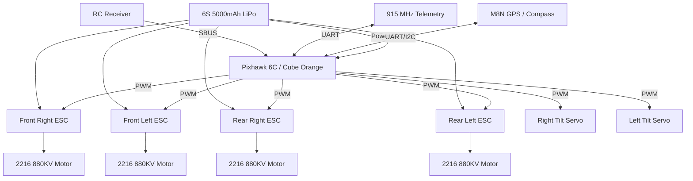
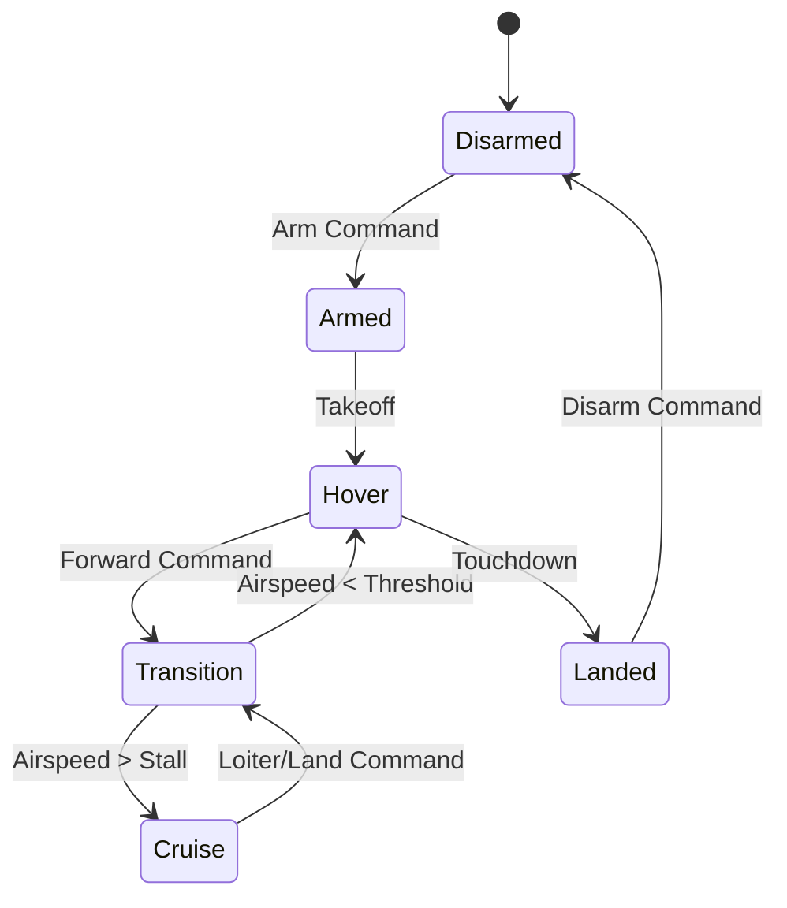

# Open Source VTOL UAV - Academic Research Project


## Rootcastle Engineering & Innovation

### Design, Simulation, and Experimental Analysis of a Modular VTOL Tilt-Rotor Unmanned Aerial Vehicle

**Author:** Batuhan Ayribas, M.Sc.  
**Affiliation:** Rootcastle Engineering & Innovation  
**Contact:** https://batuhanayribas.com  
**License:** CERN-OHL-S v2  

---

## Project Structure

```
rei-drone/
├── README.md                          # Project overview
├── LICENSE                            # CERN-OHL-S v2
├── paper/
│   └── research_paper.md              # Full academic paper
├── matlab/
│   ├── main_simulation.m              # Master simulation runner
│   ├── aerodynamics_analysis.m        # Aerodynamic force modeling
│   ├── motor_propulsion.m             # Motor and propulsion analysis
│   ├── battery_endurance.m            # Battery discharge and endurance
│   ├── flight_dynamics.m              # 6-DOF flight dynamics
│   ├── pid_controller.m               # PID controller tuning
│   ├── tilt_transition.m              # VTOL-to-cruise transition
│   ├── telemetry_link_budget.m        # RF link budget analysis
│   ├── structural_loads.m             # Structural stress analysis
│   ├── mission_planner.m              # Autonomous mission simulation
│   └── weight_cg_analysis.m           # Weight and CG estimation
├── firmware/
│   ├── src/
│   │   ├── main.cpp                   # Main flight controller entry
│   │   ├── flight_controller.h        # Flight controller header
│   │   ├── flight_controller.cpp      # Core flight control logic
│   │   ├── motor_mixer.h              # Motor mixing header
│   │   ├── motor_mixer.cpp            # VTOL motor mixing
│   │   ├── tilt_mechanism.h           # Tilt servo control header
│   │   ├── tilt_mechanism.cpp         # Tilt transition logic
│   │   ├── navigation.h               # Navigation header
│   │   ├── navigation.cpp             # GPS waypoint navigation
│   │   ├── telemetry.h                # Telemetry header
│   │   ├── telemetry.cpp              # MAVLink telemetry
│   │   ├── sensors.h                  # Sensor interface header
│   │   ├── sensors.cpp                # IMU, barometer, GPS
│   │   ├── pid.h                      # PID controller header
│   │   ├── pid.cpp                    # PID implementation
│   │   ├── battery_monitor.h          # Battery monitoring header
│   │   ├── battery_monitor.cpp        # Voltage/current sensing
│   │   ├── failsafe.h                 # Failsafe header
│   │   └── failsafe.cpp              # Emergency procedures
│   ├── config/
│   │   ├── vehicle_params.h           # Vehicle configuration
│   │   └── pin_mapping.h             # Hardware pin assignments
│   └── platformio.ini                 # PlatformIO build config
├── experiments/
│   ├── experiment_results.md          # Experiment documentation
│   └── data/                          # Raw experimental data
└── figures/
    └── (generated by MATLAB)
```

## Technical Specifications

| Parameter | Value |
|-----------|-------|
| Configuration | VTOL Tilt-Rotor |
| Wingspan | 1000 mm |
| Length | 650 mm |
| Height | 180 mm |
| Max Take-off Weight | 2.5 kg |
| Payload Capacity | 500 g |
| Max Flight Time | 30-40 min |
| Cruise Speed | 40-60 km/h |
| Max Speed | 100 km/h |
| Motors | 2216 880KV Brushless |
| Propellers | 10x4.5 (3-blade) |
| Battery | 6S LiPo, 5000 mAh |
| Flight Controller | Pixhawk 6C / Cube Orange |
| Telemetry Range | Up to 20 km (915 MHz) |
| Operating Temperature | -10 C to 50 C |

## System Architecture

### Hardware & Avionics Flow



### VTOL Transition State Machine



## Software Stack

- **Autopilot:** PX4 / ArduPilot (open source)
- **Ground Control:** QGroundControl
- **Firmware:** Customizable and extensible
- **Telemetry Protocol:** MAVLink
- **Programming Languages:** C / C++ / Python
- **Simulation:** MATLAB / Simulink

## Quick Start

1. Clone the repository
2. Run MATLAB simulations from `matlab/main_simulation.m`
3. Build firmware with PlatformIO: `cd firmware && pio run`
4. Review results in `figures/` directory

## Simulation Results

*Note: The following graphical outputs are generated by the MATLAB simulation suite located in the `matlab/` directory. Run `main_simulation.m` to generate the raw high-resolution figures.*

**Aerodynamic Performance & Power Required**


**PID Step Response (Attitude Control)**


## Citation

```bibtex
@article{ayribas2026vtol,
  title={Design, Simulation, and Experimental Analysis of a Modular VTOL Tilt-Rotor UAV},
  author={Ayribas, Batuhan},
  journal={Rootcastle Engineering Technical Reports},
  year={2026},
  publisher={Rootcastle Engineering \& Innovation}
}
```
